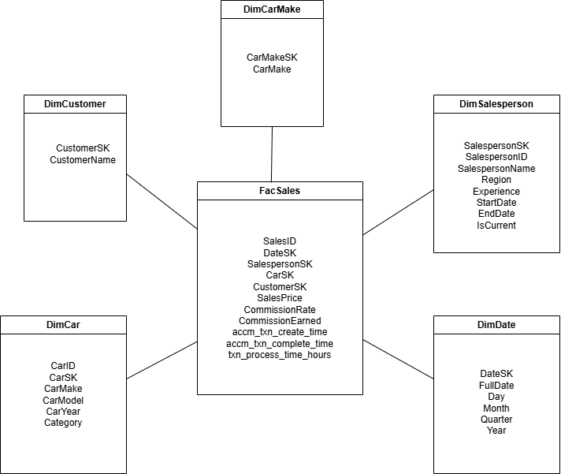
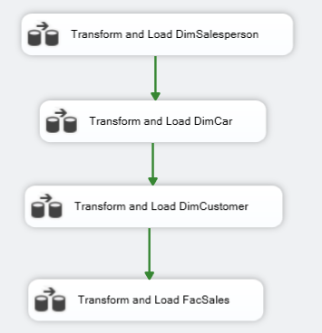
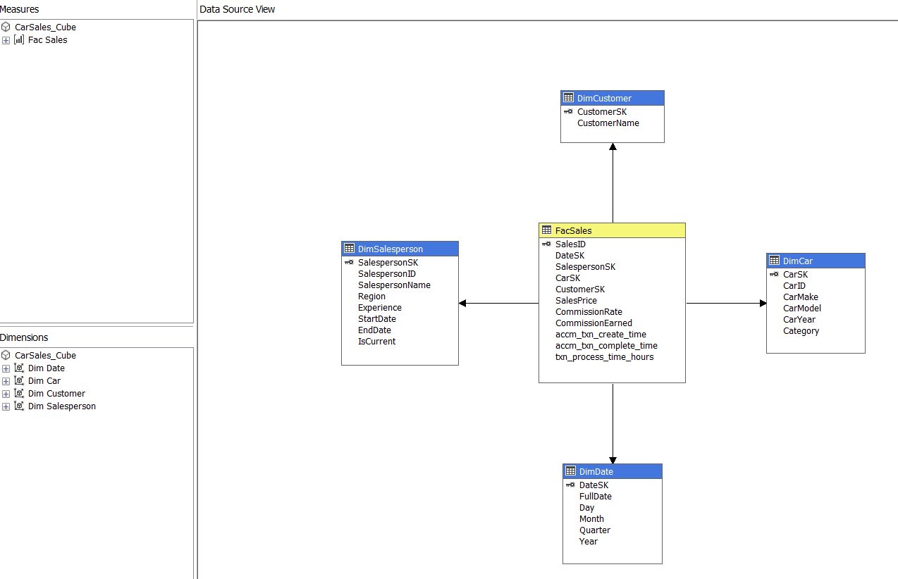
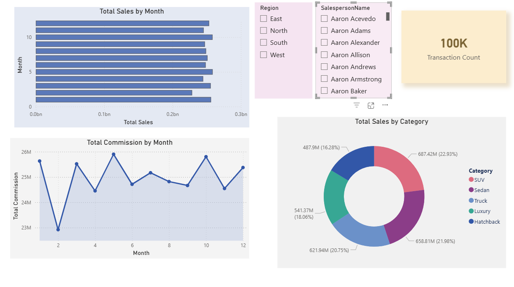

# Car Sales Data Warehouse & Business Intelligence Solution

An end-to-end Data Warehousing and Business Intelligence project built using the Microsoft BI stack.

This project demonstrates the complete lifecycle of designing and implementing a modern Data Warehouse solution, starting from raw transactional data integration to analytical reporting and OLAP analysis.

---

# Project Overview

The project uses a Car Sales transactional dataset and transforms it into a fully structured Business Intelligence environment.

The solution includes:

- Multi-source ETL pipelines
- Staging area implementation
- Star schema data warehouse design
- Slowly Changing Dimensions (SCD Type 2)
- SSIS ETL packages
- SSAS multidimensional cube
- OLAP operations using Excel
- Interactive Power BI dashboards
- DAX measures and KPIs

---

# Technologies Used

- Microsoft SQL Server
- SQL Server Integration Services (SSIS)
- SQL Server Analysis Services (SSAS)
- SQL Server Management Studio (SSMS)
- Power BI
- Microsoft Excel
- Python (Pandas)
- Google Colab

---

# Architecture

The solution follows a layered Data Warehouse architecture:

1. Source Layer
    - CSV files
    - Excel files

2. Staging Layer
    - Temporary staging tables in SQL Server

3. Data Warehouse Layer
    - Star schema dimensional model
    - Fact and dimension tables

4. BI & Analytics Layer
    - SSAS Cube
    - Excel OLAP operations
    - Power BI dashboards

---

# Data Warehouse Design

The warehouse was designed using a Star Schema.

## Fact Table
- FacSales

## Dimension Tables
- DimDate
- DimCar
- DimCarMake
- DimCustomer
- DimSalesperson

Features implemented:
- Surrogate Keys
- Slowly Changing Dimension Type 2
- Lookup transformations
- Accumulating Fact Table

---

# ETL Process

SSIS packages were developed to:

- Load data into staging tables
- Transform and clean data
- Populate dimensions and fact tables
- Handle SCD Type 2 logic
- Update accumulating fact records
- Validate data consistency

---

# SSAS Cube

A multidimensional cube named `CarSales_Cube` was implemented using SSAS.

## Measures
- Sales Price
- Commission Earned
- Commission Rate
- Transaction Processing Time

## Hierarchies
### Date Hierarchy
Year → Quarter → Month → FullDate

### Car Hierarchy
Category → CarMake → CarModel → CarYear

---

# OLAP Operations

Using Excel Pivot Tables connected to the SSAS cube:

- Roll-up
- Drill-down
- Slice
- Dice
- Pivot

were demonstrated successfully.

---

# Power BI Reports

The project includes multiple interactive reports:

1. Matrix Visual Report
2. Cascading Slicers Dashboard
3. Drill-Down Analysis Report
4. Drill-Through Detailed Report

Additional features:
- DAX Measures
- Interactive filtering
- Hierarchical analysis
- KPI visualizations

---

# Screenshots

## Star Schema

## SSIS ETL Flow

## SSAS Cube

## Power BI Dashboard

---

# Learning Outcomes

Through this project, I gained hands-on experience in:

- Data Warehouse Design
- ETL Development
- Dimensional Modeling
- SQL Optimization
- OLAP Cubes
- Business Intelligence Reporting
- Microsoft BI Stack Integration

---
